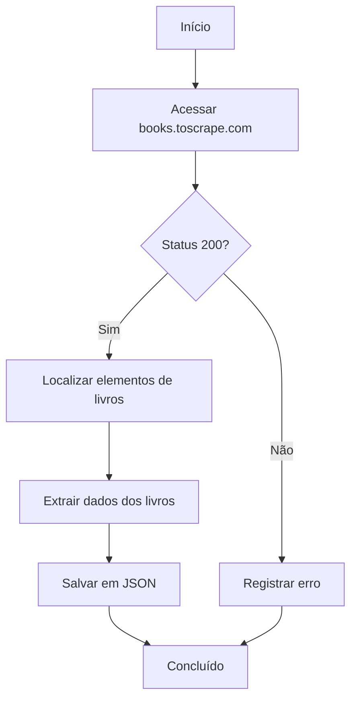

# Projeto de Web Scraping com Scrapling

Um projeto moderno de raspagem de dados web que demonstra como extrair informações de livros do site [Books to Scrape](https://books.toscrape.com/) utilizando a biblioteca Scrapling.

## 🚀 Tecnologias

- **Python 3.10+** - A linguagem de programação principal
- **[Scrapling](https://github.com/levyvix/scrapling)** - Uma biblioteca moderna, rápida e flexível para raspagem de dados web
- **UV** - Instalador e gerenciador de pacotes Python ultrarrápido
- **Loguru** - Sistema de registro de logs elegante e intuitivo
- **tqdm** - Barras de progresso para acompanhamento visual

## 📦 Instalação

1. **Clone o repositório**
   ```bash
   git clone https://github.com/levyvix/web-scraping-project.git
   cd web-scraping-project
   ```

2. **Instale as dependências usando UV**
   ```bash
   # Instale o UV se ainda não tiver
   pip install uv

   # Sincronize as dependências
   uv sync
   ```

   Este comando instalará todas as dependências necessárias em um ambiente virtual isolado.

## 🛠️ Estrutura do Projeto

```
.
├── main.py                      # Script principal contendo a lógica de raspagem de dados
├── utils/                       # Módulos utilitários
│   ├── __init__.py
│   └── logger.py               # Configuração do sistema de logs
├── output/                     # Diretório de saída (criado automaticamente)
│   └── books.json              # Dados dos livros extraídos
├── logs/                       # Logs da aplicação (criado automaticamente)
│   └── app.log
├── scripts/                    # Scripts auxiliares
│   ├── docker-run.sh          # Script helper para Linux/macOS/Git Bash
│   └── docker-run.bat         # Script helper para Windows
├── tests/                      # Testes automatizados
│   └── test_main/
├── docker-compose.yml          # Configuração principal do Docker Compose
├── docker-compose.override.yml # Configurações de desenvolvimento
├── docker-compose.examples.yml # Exemplos de configurações
├── Dockerfile                  # Definição da imagem Docker
├── .dockerignore              # Arquivos ignorados pelo Docker
├── pyproject.toml             # Dependências e metadados do projeto
├── uv.lock                    # Versões travadas das dependências
└── README.md                  # Este arquivo
```

## 🚀 Uso

### 🐳 Execução com Docker (Recomendado)

A maneira mais fácil de executar o projeto é usando Docker Compose, que garante um ambiente consistente e isolado.

#### Uso Básico com Docker

Execute o raspador com as configurações padrão (uma página, 10 threads de processamento):

```bash
docker-compose run --rm scraper
```

#### Opções Avançadas com Docker

O script suporta os seguintes argumentos de linha de comando:

- `--threads`: Número de threads de processamento para extração simultânea (padrão: 10)
- `--pages`: Número máximo de páginas para processar (padrão: 1)

**Exemplos de Combinações de Parâmetros:**

```bash
# Configurações básicas
docker-compose run --rm scraper                           # Padrão: 10 threads, 1 página
docker-compose run --rm scraper --threads 15              # 15 threads, 1 página
docker-compose run --rm scraper --pages 5                 # 10 threads, 5 páginas

# Configurações combinadas
docker-compose run --rm scraper --threads 15 --pages 3    # 15 threads, 3 páginas
docker-compose run --rm scraper --threads 20 --pages 10   # Alta performance
docker-compose run --rm scraper --threads 5 --pages 1     # Configuração leve

# Configurações específicas por cenário
docker-compose run --rm scraper --threads 1 --pages 1     # Debug/teste mínimo
docker-compose run --rm scraper --threads 8 --pages 2     # Configuração média
docker-compose run --rm scraper --threads 25 --pages 15   # Máxima performance
```

**Guia de Configuração por Uso:**

| Cenário | Threads | Páginas | Comando |
|---------|---------|---------|---------|
| Teste rápido | 1-5 | 1 | `docker-compose run --rm scraper --threads 5 --pages 1` |
| Desenvolvimento | 5-10 | 1-2 | `docker-compose run --rm scraper --threads 8 --pages 2` |
| Produção normal | 10-15 | 3-5 | `docker-compose run --rm scraper --threads 12 --pages 5` |
| Alta performance | 20-25 | 10+ | `docker-compose run --rm scraper --threads 20 --pages 10` |
| Recursos limitados | 3-5 | 1-2 | `docker-compose run --rm scraper --threads 3 --pages 1` |

#### Scripts de Conveniência

Para facilitar o uso, incluímos scripts auxiliares que permitem executar diferentes configurações predefinidas:

**Linux/macOS/Git Bash:**
```bash
# Tornar o script executável (apenas na primeira vez)
chmod +x scripts/docker-run.sh

# Configuração básica (padrão: 10 threads, 1 página)
./scripts/docker-run.sh basic

# Alta performance (20 threads, 10 páginas)
./scripts/docker-run.sh performance

# Configuração leve para testes (5 threads, 1 página)
./scripts/docker-run.sh light

# Modo desenvolvimento com código fonte montado
./scripts/docker-run.sh dev

# Passar argumentos adicionais do Docker Compose
./scripts/docker-run.sh performance --build

# Ver todas as opções disponíveis
./scripts/docker-run.sh examples
```

**Windows (Command Prompt ou PowerShell):**
```cmd
# Configuração básica (padrão: 10 threads, 1 página)
scripts\docker-run.bat basic

# Alta performance (20 threads, 10 páginas)
scripts\docker-run.bat performance

# Configuração leve para testes (5 threads, 1 página)
scripts\docker-run.bat light

# Modo desenvolvimento
scripts\docker-run.bat dev

# Ver todas as opções disponíveis
scripts\docker-run.bat examples
```

**Perfis Disponíveis:**
- `basic` ou `default`: Configuração padrão com argumentos personalizáveis
- `performance` ou `perf`: Alta performance (20 threads, 10 páginas)
- `light` ou `test`: Configuração leve (5 threads, 1 página)
- `dev` ou `development`: Modo desenvolvimento com código fonte montado

#### Configurações Predefinidas

O projeto inclui várias configurações Docker Compose para diferentes cenários:

- **scraper** (padrão): Configuração básica com argumentos personalizáveis
- **scraper-performance**: Alta performance (20 threads, 10 páginas)
- **scraper-light**: Configuração leve para testes (5 threads, 1 página)

```bash
# Executar configuração de alta performance
docker-compose --profile performance up scraper-performance

# Executar configuração leve
docker-compose --profile light up scraper-light
```

### 💻 Execução Local (Desenvolvimento)

Para desenvolvimento local sem Docker:

#### Uso Básico

Execute o raspador com as configurações padrão:

```bash
uv run main.py
```

#### Opções Avançadas

```bash
# Executar com 15 threads
uv run main.py --threads 15

# Processar 5 páginas
uv run main.py --pages 5

# Combinar argumentos
uv run main.py --threads 15 --pages 3

# Exibir ajuda
uv run main.py --help
```

### 📁 Saída

#### Com Docker
Os dados extraídos serão salvos no diretório `./output/books.json` (montado como volume). Os logs da aplicação ficam disponíveis em `./logs/app.log`.

#### Execução Local
Os dados extraídos serão salvos no arquivo `books.json` localizado no diretório raiz do projeto.

O arquivo conterá uma lista de objetos representando livros, cada um com a seguinte estrutura:

```json
{
  "title": "Book Title",
  "price": "£10.00",
  "stock_available": "In stock"
}
```

## 🐳 Docker

### Pré-requisitos

- [Docker](https://docs.docker.com/get-docker/)
- [Docker Compose](https://docs.docker.com/compose/install/)

### Estrutura Docker

O projeto inclui uma configuração Docker completa com:

- **Dockerfile multi-stage**: Build otimizado com estágios separados para dependências e runtime
- **docker-compose.yml**: Configuração principal com diferentes perfis
- **docker-compose.override.yml**: Configurações de desenvolvimento (carregado automaticamente)
- **docker-compose.examples.yml**: Exemplos de configurações para diferentes cenários

### Volumes e Persistência de Dados

#### Configuração de Volumes

O Docker Compose está configurado para montar volumes que garantem a persistência dos dados entre execuções:

```yaml
volumes:
  - ./output:/app/output    # Arquivos de saída (books.json)
  - ./logs:/app/logs        # Logs da aplicação
```

#### Como Funciona a Persistência

**Diretórios Mapeados:**
- **Host: `./output`** → **Container: `/app/output`**
  - Contém o arquivo `books.json` com os dados extraídos
  - Dados persistem após o container parar
  - Acessível diretamente no sistema host

- **Host: `./logs`** → **Container: `/app/logs`**
  - Contém `app.log` com logs detalhados da aplicação
  - Logs são mantidos entre execuções
  - Útil para debugging e monitoramento

#### Configuração Manual de Volumes

**Criação de Diretórios:**
```bash
# Criar diretórios necessários (se não existirem)
mkdir -p output logs

# Definir permissões adequadas (Linux/macOS)
chmod 755 output logs
```

**Mapeamento Personalizado:**
```bash
# Usar diretórios personalizados
docker run --rm \
  -v "/caminho/personalizado/output:/app/output" \
  -v "/caminho/personalizado/logs:/app/logs" \
  book-scraper

# Usar volumes nomeados do Docker
docker volume create book-scraper-output
docker volume create book-scraper-logs

docker run --rm \
  -v "book-scraper-output:/app/output" \
  -v "book-scraper-logs:/app/logs" \
  book-scraper
```

#### Verificação de Persistência

**Testar Persistência de Dados:**
```bash
# 1. Executar scraper
docker-compose run --rm scraper --threads 5 --pages 1

# 2. Verificar se arquivos foram criados no host
ls -la output/  # Deve mostrar books.json
ls -la logs/    # Deve mostrar app.log

# 3. Executar novamente - dados anteriores devem persistir
docker-compose run --rm scraper --threads 5 --pages 1

# 4. Verificar se dados foram preservados/atualizados
cat output/books.json | jq length  # Contar registros (se jq estiver instalado)
tail -n 20 logs/app.log           # Ver últimas linhas do log
```

#### Gerenciamento de Dados

**Limpeza de Dados:**
```bash
# Limpar apenas arquivos de saída
rm -f output/books.json

# Limpar logs
rm -f logs/app.log

# Limpar tudo
rm -rf output/* logs/*
```

**Backup de Dados:**
```bash
# Criar backup dos dados
tar -czf backup-$(date +%Y%m%d).tar.gz output/ logs/

# Restaurar backup
tar -xzf backup-20240315.tar.gz
```

#### Problemas Comuns com Volumes

**Permissões (Linux/macOS):**
```bash
# Se houver problemas de permissão
sudo chown -R $USER:$USER output logs
chmod -R 755 output logs
```

**Windows - Compartilhamento de Drive:**
- Certifique-se de que o drive está compartilhado no Docker Desktop
- Vá em Settings → Resources → File Sharing
- Adicione o diretório do projeto se necessário

**Volumes Vazios:**
```bash
# Verificar se volumes estão sendo montados corretamente
docker-compose config | grep -A 5 volumes

# Inspecionar container em execução
docker inspect $(docker-compose ps -q scraper) | grep -A 10 Mounts
```

### Configurações Disponíveis

#### Desenvolvimento (Padrão)
```bash
docker-compose up scraper
```
- Inclui montagem do código fonte para desenvolvimento
- Variável DEBUG=1 habilitada
- Modo interativo (stdin_open: true, tty: true)

#### Produção
```bash
docker-compose -f docker-compose.yml up scraper
```
- Sem montagem de código fonte
- Otimizado para performance
- Sem variáveis de debug

#### Alta Performance
```bash
docker-compose --profile performance up scraper-performance
```
- 20 threads de processamento
- 10 páginas processadas
- Configuração otimizada para máxima velocidade

#### Testes Leves
```bash
docker-compose --profile light up scraper-light
```
- 5 threads de processamento
- 1 página processada
- Ideal para testes rápidos

### Construção e Execução Manual

#### Construindo a Imagem Docker

```bash
# Construção básica
docker build -t book-scraper .

# Construção com cache limpo (recomendado para primeira execução)
docker build --no-cache -t book-scraper .

# Construção com tag específica
docker build -t book-scraper:latest .
docker build -t book-scraper:v1.0 .
```

#### Execução Manual com Docker

**Execução Básica:**
```bash
# Execução simples (dados salvos dentro do container - não persistem)
docker run --rm book-scraper

# Execução com volumes para persistência de dados
docker run --rm \
  -v "$(pwd)/output:/app/output" \
  -v "$(pwd)/logs:/app/logs" \
  book-scraper
```

**Execução com Parâmetros Personalizados:**
```bash
# Diferentes combinações de threads e páginas
docker run --rm \
  -v "$(pwd)/output:/app/output" \
  -v "$(pwd)/logs:/app/logs" \
  book-scraper --threads 15 --pages 3

# Execução de alta performance
docker run --rm \
  -v "$(pwd)/output:/app/output" \
  -v "$(pwd)/logs:/app/logs" \
  book-scraper --threads 20 --pages 10

# Execução leve para testes
docker run --rm \
  -v "$(pwd)/output:/app/output" \
  -v "$(pwd)/logs:/app/logs" \
  book-scraper --threads 5 --pages 1
```

**Execução Interativa para Debug:**
```bash
# Acessar container interativamente
docker run -it --rm \
  -v "$(pwd)/output:/app/output" \
  -v "$(pwd)/logs:/app/logs" \
  --entrypoint /bin/bash \
  book-scraper

# Executar com código fonte montado (desenvolvimento)
docker run --rm \
  -v "$(pwd):/app" \
  -v "$(pwd)/output:/app/output" \
  -v "$(pwd)/logs:/app/logs" \
  book-scraper --threads 5 --pages 1
```

#### Exemplos de Comandos por Cenário

**Desenvolvimento e Testes:**
```bash
# Teste rápido com mínimos recursos
docker run --rm -v "$(pwd)/output:/app/output" book-scraper --threads 1 --pages 1

# Desenvolvimento com código fonte montado
docker run --rm \
  -v "$(pwd):/app" \
  -v "$(pwd)/output:/app/output" \
  -v "$(pwd)/logs:/app/logs" \
  book-scraper --threads 5
```

**Produção:**
```bash
# Execução otimizada para produção
docker run -d \
  --name book-scraper-prod \
  -v "/data/output:/app/output" \
  -v "/data/logs:/app/logs" \
  --restart unless-stopped \
  book-scraper --threads 15 --pages 5

# Monitorar execução em produção
docker logs -f book-scraper-prod
```

**Execução Programada (Cron-like):**
```bash
# Execução única com limpeza automática
docker run --rm \
  -v "$(pwd)/output:/app/output" \
  -v "$(pwd)/logs:/app/logs" \
  book-scraper --threads 10 --pages 3

# Para uso em scripts automatizados
#!/bin/bash
OUTPUT_DIR="/path/to/output"
LOG_DIR="/path/to/logs"
docker run --rm \
  -v "${OUTPUT_DIR}:/app/output" \
  -v "${LOG_DIR}:/app/logs" \
  book-scraper --threads 15 --pages 5
```

### Troubleshooting Docker

#### Problemas Comuns e Soluções

**1. Permissões de Volume**
```bash
# Problema: Erro de permissão ao acessar volumes
# Solução: Criar diretórios com permissões adequadas
mkdir -p output logs
chmod 755 output logs

# No Windows, certifique-se de que o Docker Desktop tem acesso ao drive
```

**2. Imagem não Encontrada**
```bash
# Problema: "image not found" ou "pull access denied"
# Solução: Construir a imagem localmente
docker-compose build scraper

# Ou construir forçando rebuild
docker-compose build --no-cache scraper
```

**3. Conflitos de Porta**
```bash
# Problema: Porta já em uso
# Solução: Modificar porta no docker-compose.yml ou parar serviços conflitantes
docker-compose down
# Ou modificar a porta no arquivo docker-compose.yml
```

**4. Memória Insuficiente**
```bash
# Problema: Container termina inesperadamente com alta carga
# Solução: Reduzir número de threads ou aumentar memória do Docker
docker-compose run --rm scraper --threads 5 --pages 1

# Verificar recursos disponíveis
docker system df
docker stats
```

**5. Volumes Vazios ou Dados não Persistem**
```bash
# Problema: Arquivos não aparecem no host
# Solução: Verificar mapeamento de volumes
docker-compose config  # Verificar configuração

# Executar com volumes explícitos
docker run --rm \
  -v "$(pwd)/output:/app/output" \
  -v "$(pwd)/logs:/app/logs" \
  book-scraper --threads 10 --pages 1
```

**6. Problemas de Rede/Conectividade**
```bash
# Problema: Falha ao acessar sites externos
# Solução: Verificar configurações de proxy/firewall
docker-compose run --rm scraper --threads 1 --pages 1

# Testar conectividade dentro do container
docker-compose run --rm --entrypoint /bin/bash scraper
# Dentro do container: curl -I https://books.toscrape.com/
```

**7. Erro de Dependências Python**
```bash
# Problema: Módulos Python não encontrados
# Solução: Reconstruir imagem com cache limpo
docker-compose build --no-cache scraper

# Verificar se todas as dependências foram instaladas
docker-compose run --rm --entrypoint "pip list" scraper
```

#### Comandos de Debug e Diagnóstico

```bash
# Ver logs detalhados em tempo real
docker-compose logs -f scraper

# Executar em modo debug com verbose
docker-compose run --rm scraper --threads 1 --pages 1

# Acessar container interativamente para debug
docker-compose run --rm --entrypoint /bin/bash scraper

# Verificar configuração do Docker Compose
docker-compose config

# Inspecionar imagem construída
docker image inspect book-scraper

# Verificar uso de recursos
docker stats

# Limpar recursos Docker (cuidado em produção)
docker system prune -f
docker volume prune -f
```

#### Verificação de Saúde do Container

```bash
# Verificar se o container está executando corretamente
docker-compose ps

# Testar execução básica
docker-compose run --rm scraper --help

# Verificar logs de erro
docker-compose logs scraper | grep -i error

# Monitorar recursos durante execução
docker stats $(docker-compose ps -q scraper)
```

#### Problemas Específicos por Sistema Operacional

**Windows:**
- Certifique-se de que o Docker Desktop está executando
- Verifique se o drive está compartilhado nas configurações do Docker Desktop
- Use PowerShell ou Command Prompt como administrador se necessário

**macOS:**
- Verifique as configurações de recursos do Docker Desktop
- Certifique-se de que o Docker tem permissões de acesso aos diretórios

**Linux:**
- Adicione seu usuário ao grupo docker: `sudo usermod -aG docker $USER`
- Reinicie a sessão após adicionar ao grupo
- Verifique se o serviço Docker está ativo: `sudo systemctl status docker`

## 🔍 Sobre o Scrapling

Este projeto utiliza [Scrapling](https://github.com/levyvix/scrapling), uma biblioteca moderna para raspagem de dados web que oferece:

- Interface de programação (API) simples e intuitiva
- Suporte nativo para tecnologias web modernas
- Compatibilidade com programação assíncrona (async/await)
- Controle de taxa de requisições e tentativas automáticas
- Suporte completo para seletores CSS e XPath

## 🧪 Testes e Desenvolvimento

### Configuração do Ambiente de Desenvolvimento

1. Instale as dependências de desenvolvimento:
   ```bash
   uv sync --all-groups
   ```

   Este comando instalará todas as ferramentas necessárias para desenvolvimento, incluindo pytest e ferramentas de cobertura de código.

### Execução de Testes com Cobertura

Para executar os testes e gerar um relatório de cobertura de código:

```bash
uv run pytest --cov=. --cov-report=html
```

Este comando realizará as seguintes ações:
- Executar todos os testes do projeto
- Gerar um relatório detalhado de cobertura de código
- Criar um relatório HTML interativo no diretório `htmlcov`

Para visualizar o relatório de cobertura, abra o arquivo `htmlcov/index.html` em seu navegador web.

### Padrões de Cobertura de Testes

O projeto busca manter alta cobertura de testes. O relatório de cobertura auxilia na identificação de áreas do código que necessitam de testes adicionais.

## 📝 Como Contribuir

1. Faça um fork do repositório (`git clone https://github.com/levyvix/web-scraping-project.git`)
2. Crie uma branch para sua funcionalidade (`git checkout -b feature/nova-funcionalidade`)
3. Faça commit das suas alterações (`git commit -m 'Adiciona nova funcionalidade'`)
4. Envie as alterações para sua branch (`git push origin feature/nova-funcionalidade`)
5. Abra um Pull Request

Por favor, certifique-se de que todos os testes estejam passando e mantenha a alta cobertura de código antes de submeter um PR.

## 📊 Fluxo de Dados



## 🐛 Depuração com VS Code

Este projeto inclui uma configuração `.vscode/launch.json` que facilita a depuração do script com diferentes parâmetros no VS Code.

### Como Realizar a Depuração com Argumentos

1. **Abra o Painel de Depuração**
   - Clique no ícone "Run and Debug" na barra lateral do VS Code (ou pressione `Ctrl+Shift+D`).

2. **Selecione a Configuração de Depuração**
   - Escolha "Python: main.py com argumentos" no menu suspenso no topo do painel de Depuração.

3. **Modifique os Argumentos (Opcional)**
   Para alterar os parâmetros passados para o script durante a depuração:
   - Abra o arquivo `.vscode/launch.json`
   - Localize o array `args` na configuração
   - Adicione, remova ou modifique argumentos conforme necessário

   Por exemplo, para executar com parâmetros diferentes:
   ```json
   "args": ["--threads", "15", "--pages", "3"]
   ```

4. **Inicie a Depuração**
   - Clique no botão verde de execução ou pressione `F5` para iniciar a depuração com os argumentos especificados.

### Cenários Comuns de Depuração

- **Depuração básica com argumentos padrão**: Simplesmente pressione `F5`
- **Depurar com número diferente de threads**: Modifique os `args` em `launch.json` para `["--threads", "5"]`
- **Depurar com múltiplas páginas**: Configure os argumentos para `["--pages", "3"]` para processar múltiplas páginas

### Pontos de Interrupção (Breakpoints)

Você pode definir pontos de interrupção em seu código clicando na margem esquerda ao lado dos números das linhas. O depurador pausará a execução nesses pontos, permitindo que você inspecione variáveis e execute o código passo a passo.


## 📚 Documentação Adicional

- **[🚀 Guia de Início Rápido](docs/QUICKSTART.md)** - Execute o projeto em menos de 5 minutos
- **[🐳 Documentação Docker](docs/DOCKER.md)** - Guia completo sobre configurações Docker
- **[📊 Exemplos de Configuração](docker-compose.examples.yml)** - Configurações predefinidas para diferentes cenários

## 📄 Licença

Este projeto está licenciado sob a Licença MIT - veja o arquivo [LICENSE](LICENSE) para detalhes.
