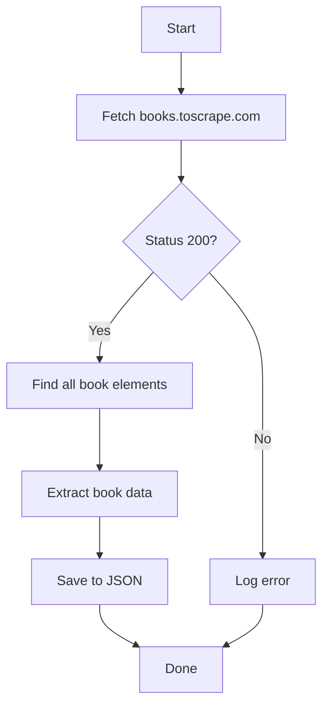

# Web Scraping Project with Scrapling

A modern web scraping project that demonstrates how to extract book information from [Books to Scrape](https://books.toscrape.com/) using the Scrapling library.

## 🚀 Technologies

- **Python 3.10+** - The core programming language
- **[Scrapling](https://github.com/levy-victor/scrapling)** - A modern, fast, and flexible web scraping library
- **UV** - A fast Python package installer and resolver
- **Loguru** - For beautiful and easy logging
- **tqdm** - For progress bars

## 📦 Installation

1. **Clone the repository**
   ```bash
   git clone https://github.com/your-username/web-scraping-project.git
   cd web-scraping-project
   ```

2. **Install dependencies using UV**
   ```bash
   # Install UV if you haven't already
   pip install uv
   
   # Sync dependencies
   uv sync
   ```

   This will install all the required dependencies in a virtual environment.

## 🛠️ Project Structure

```
.
├── main.py           # Main script containing the web scraping logic
├── books.json        # Output file with scraped book data
├── pyproject.toml    # Project dependencies and metadata
└── README.md         # This file
```

## 🚀 Usage

1. **Run the scraper**
   ```bash
   python main.py
   ```

2. **Check the output**
   The scraped data will be saved to `books.json` in the project root.

## 🔍 About Scrapling

This project uses [Scrapling](https://github.com/levy-victor/scrapling), a modern web scraping library that provides:

- Simple and intuitive API
- Built-in support for modern web technologies
- Async/await support
- Built-in rate limiting and retries
- Support for both CSS and XPath selectors

## 📊 Data Flow



## 🤝 Contributing

Contributions are welcome! Please feel free to submit a Pull Request.

## 📄 License

This project is licensed under the MIT License - see the [LICENSE](LICENSE) file for details.
