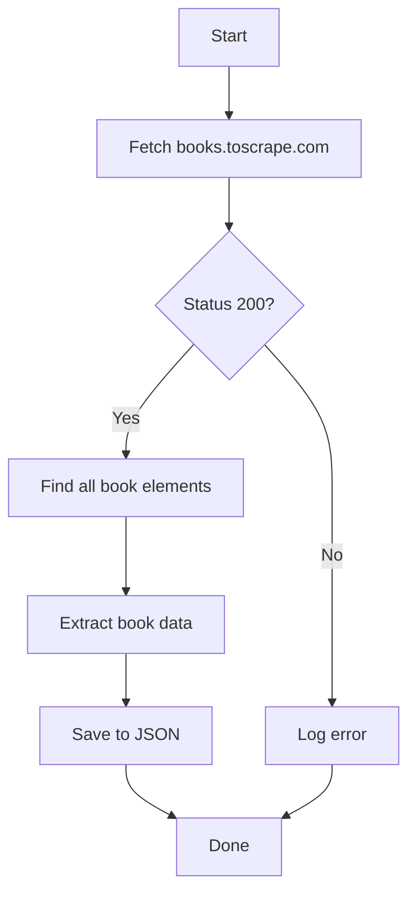

# Web Scraping Project with Scrapling

A modern web scraping project that demonstrates how to extract book information from [Books to Scrape](https://books.toscrape.com/) using the Scrapling library.

## 🚀 Technologies

- **Python 3.10+** - The core programming language
- **[Scrapling](https://github.com/levyvix/scrapling)** - A modern, fast, and flexible web scraping library
- **UV** - A fast Python package installer and resolver
- **Loguru** - For beautiful and easy logging
- **tqdm** - For progress bars

## 📦 Installation

1. **Clone the repository**
   ```bash
   git clone https://github.com/levyvix/web-scraping-project.git
   cd web-scraping-project
   ```

2. **Install dependencies using UV**
   ```bash
   # Install UV if you haven't already
   pip install uv
   
   # Sync dependencies
   uv sync
   ```

   This will install all the required dependencies in a virtual environment.

## 🛠️ Project Structure

```
.
├── main.py           # Main script containing the web scraping logic
├── books.json        # Output file with scraped book data
├── pyproject.toml    # Project dependencies and metadata
└── README.md         # This file
```

## 🚀 Usage

### Basic Usage

Run the scraper with default settings (single page, 10 worker threads):

```bash
uv run main.py
```

### Advanced Options

The script supports the following command-line arguments:

- `--threads`: Number of worker threads to use for concurrent scraping (default: 10)
  ```bash
  uv run main.py --threads 15
  ```

- `--pages`: Maximum number of pages to scrape (default: 1)
  ```bash
  uv run main.py --pages 5
  ```

### Examples

1. Scrape 3 pages using 15 worker threads:
   ```bash
   uv run main.py --threads 15 --pages 3
   ```

2. Scrape just the first page with default settings:
   ```bash
   uv run main.py
   ```

3. View help message:
   ```bash
   uv run main.py --help
   ```

### Output

The scraped data will be saved to `books.json` in the project root directory. The file will contain an array of book objects, each with the following structure:

```json
{
  "title": "Book Title",
  "price": "£10.00",
  "stock_available": "In stock"
}
```

## 🔍 About Scrapling

This project uses [Scrapling](https://github.com/levyvix/scrapling), a modern web scraping library that provides:

- Simple and intuitive API
- Built-in support for modern web technologies
- Async/await support

## 🧪 Testing and Development

### Setting Up Development Environment

1. Install development dependencies:
   ```bash
   uv sync --all-groups
   ```

   This will install all development tools including pytest and coverage.

### Running Tests with Coverage

To run tests and generate a coverage report:

```bash
uv run pytest --cov=. --cov-report=html
```

This command will:
- Execute all tests in the project
- Generate code coverage report
- Create an HTML report in the `htmlcov` directory

You can view the coverage report by opening `htmlcov/index.html` in your web browser.

### Test Coverage Requirements

The project aims for high test coverage. The coverage report will help identify areas of the code that need more test coverage.

## 📝 Contributing

1. Fork the repository (`git clone https://github.com/levyvix/web-scraping-project.git`)
2. Create your feature branch (`git checkout -b feature/amazing-feature`)
3. Commit your changes (`git commit -m 'Add some amazing feature'`)
4. Push to the branch (`git push origin feature/amazing-feature`)
5. Open a Pull Request

Please ensure all tests pass and maintain high test coverage before submitting a PR.
- Built-in rate limiting and retries
- Support for both CSS and XPath selectors

## 📊 Data Flow



## 🐛 Debugging with VS Code

This project includes a `.vscode/launch.json` configuration that makes it easy to debug the script with different arguments in VS Code.

### How to Debug with Arguments

1. **Open the Debug Panel**
   - Click on the "Run and Debug" icon in the VS Code sidebar (or press `Ctrl+Shift+D`).

2. **Select the Debug Configuration**
   - Choose "Python: main.py com argumentos" from the dropdown at the top of the Debug panel.

3. **Modify Arguments (Optional)**
   To change the arguments passed to the script during debugging:
   - Open `.vscode/launch.json`
   - Locate the `args` array in the configuration
   - Add, remove, or modify arguments as needed
   
   For example, to run with different arguments:
   ```json
   "args": ["--threads", "15", "--pages", "3"]
   ```

4. **Start Debugging**
   - Click the green play button or press `F5` to start debugging with the specified arguments.

### Common Debugging Scenarios

- **Basic debugging with default arguments**: Just press `F5`
- **Debug with different thread count**: Modify the `args` in `launch.json` to `["--threads", "5"]`
- **Debug with multiple pages**: Set arguments to `["--pages", "3"]` to scrape multiple pages

### Breakpoints

You can set breakpoints in your code by clicking in the left margin next to the line numbers. The debugger will pause execution at these points, allowing you to inspect variables and step through your code.

## 🤝 Contributing

Contributions are welcome! Please feel free to submit a Pull Request.

## 📄 License

This project is licensed under the MIT License - see the [LICENSE](LICENSE) file for details.
