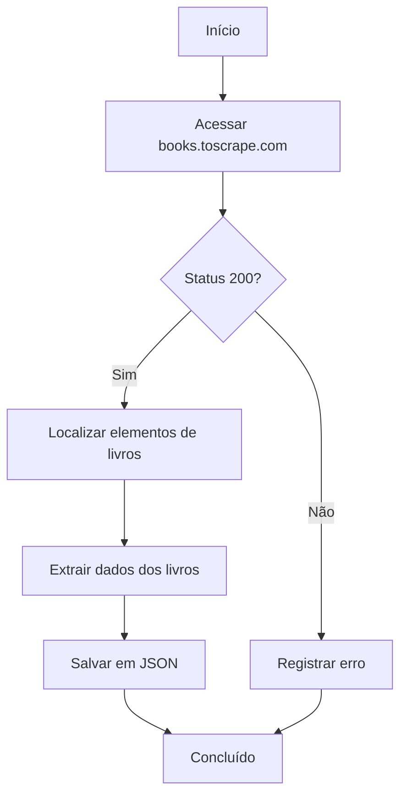

# Projeto de Web Scraping com Scrapling

Um projeto moderno de raspagem de dados web que demonstra como extrair informações de livros do site [Books to Scrape](https://books.toscrape.com/) utilizando a biblioteca Scrapling.

## 🚀 Tecnologias

- **Python 3.10+** - A linguagem de programação principal
- **[Scrapling](https://github.com/levyvix/scrapling)** - Uma biblioteca moderna, rápida e flexível para raspagem de dados web
- **UV** - Instalador e gerenciador de pacotes Python ultrarrápido
- **Loguru** - Sistema de registro de logs elegante e intuitivo
- **tqdm** - Barras de progresso para acompanhamento visual

## 📦 Instalação

1. **Clone o repositório**
   ```bash
   git clone https://github.com/levyvix/web-scraping-project.git
   cd web-scraping-project
   ```

2. **Instale as dependências usando UV**
   ```bash
   # Instale o UV se ainda não tiver
   pip install uv

   # Sincronize as dependências
   uv sync
   ```

   Este comando instalará todas as dependências necessárias em um ambiente virtual isolado.

## 🛠️ Estrutura do Projeto

```
.
├── main.py           # Script principal contendo a lógica de raspagem de dados
├── books.json        # Arquivo de saída com dados dos livros extraídos
├── pyproject.toml    # Dependências e metadados do projeto
└── README.md         # Este arquivo
```

## 🚀 Uso

### Uso Básico

Execute o raspador com as configurações padrão (uma página, 10 threads de processamento):

```bash
uv run main.py
```

### Opções Avançadas

O script suporta os seguintes argumentos de linha de comando:

- `--threads`: Número de threads de processamento para extração simultânea (padrão: 10)
  ```bash
  uv run main.py --threads 15
  ```

- `--pages`: Número máximo de páginas para processar (padrão: 1)
  ```bash
  uv run main.py --pages 5
  ```

### Exemplos

1. Extrair dados de 3 páginas utilizando 15 threads de processamento:
   ```bash
   uv run main.py --threads 15 --pages 3
   ```

2. Extrair dados apenas da primeira página com as configurações padrão:
   ```bash
   uv run main.py
   ```

3. Exibir a mensagem de ajuda:
   ```bash
   uv run main.py --help
   ```

### Saída

Os dados extraídos serão salvos no arquivo `books.json` localizado no diretório raiz do projeto. O arquivo conterá uma lista de objetos representando livros, cada um com a seguinte estrutura:

```json
{
  "title": "Book Title",
  "price": "£10.00",
  "stock_available": "In stock"
}
```

## 🔍 Sobre o Scrapling

Este projeto utiliza [Scrapling](https://github.com/levyvix/scrapling), uma biblioteca moderna para raspagem de dados web que oferece:

- Interface de programação (API) simples e intuitiva
- Suporte nativo para tecnologias web modernas
- Compatibilidade com programação assíncrona (async/await)
- Controle de taxa de requisições e tentativas automáticas
- Suporte completo para seletores CSS e XPath

## 🧪 Testes e Desenvolvimento

### Configuração do Ambiente de Desenvolvimento

1. Instale as dependências de desenvolvimento:
   ```bash
   uv sync --all-groups
   ```

   Este comando instalará todas as ferramentas necessárias para desenvolvimento, incluindo pytest e ferramentas de cobertura de código.

### Execução de Testes com Cobertura

Para executar os testes e gerar um relatório de cobertura de código:

```bash
uv run pytest --cov=. --cov-report=html
```

Este comando realizará as seguintes ações:
- Executar todos os testes do projeto
- Gerar um relatório detalhado de cobertura de código
- Criar um relatório HTML interativo no diretório `htmlcov`

Para visualizar o relatório de cobertura, abra o arquivo `htmlcov/index.html` em seu navegador web.

### Padrões de Cobertura de Testes

O projeto busca manter alta cobertura de testes. O relatório de cobertura auxilia na identificação de áreas do código que necessitam de testes adicionais.

## 📝 Como Contribuir

1. Faça um fork do repositório (`git clone https://github.com/levyvix/web-scraping-project.git`)
2. Crie uma branch para sua funcionalidade (`git checkout -b feature/nova-funcionalidade`)
3. Faça commit das suas alterações (`git commit -m 'Adiciona nova funcionalidade'`)
4. Envie as alterações para sua branch (`git push origin feature/nova-funcionalidade`)
5. Abra um Pull Request

Por favor, certifique-se de que todos os testes estejam passando e mantenha a alta cobertura de código antes de submeter um PR.

## 📊 Fluxo de Dados



## 🐛 Depuração com VS Code

Este projeto inclui uma configuração `.vscode/launch.json` que facilita a depuração do script com diferentes parâmetros no VS Code.

### Como Realizar a Depuração com Argumentos

1. **Abra o Painel de Depuração**
   - Clique no ícone "Run and Debug" na barra lateral do VS Code (ou pressione `Ctrl+Shift+D`).

2. **Selecione a Configuração de Depuração**
   - Escolha "Python: main.py com argumentos" no menu suspenso no topo do painel de Depuração.

3. **Modifique os Argumentos (Opcional)**
   Para alterar os parâmetros passados para o script durante a depuração:
   - Abra o arquivo `.vscode/launch.json`
   - Localize o array `args` na configuração
   - Adicione, remova ou modifique argumentos conforme necessário

   Por exemplo, para executar com parâmetros diferentes:
   ```json
   "args": ["--threads", "15", "--pages", "3"]
   ```

4. **Inicie a Depuração**
   - Clique no botão verde de execução ou pressione `F5` para iniciar a depuração com os argumentos especificados.

### Cenários Comuns de Depuração

- **Depuração básica com argumentos padrão**: Simplesmente pressione `F5`
- **Depurar com número diferente de threads**: Modifique os `args` em `launch.json` para `["--threads", "5"]`
- **Depurar com múltiplas páginas**: Configure os argumentos para `["--pages", "3"]` para processar múltiplas páginas

### Pontos de Interrupção (Breakpoints)

Você pode definir pontos de interrupção em seu código clicando na margem esquerda ao lado dos números das linhas. O depurador pausará a execução nesses pontos, permitindo que você inspecione variáveis e execute o código passo a passo.


## 📄 Licença

Este projeto está licenciado sob a Licença MIT - veja o arquivo [LICENSE](LICENSE) para detalhes.
