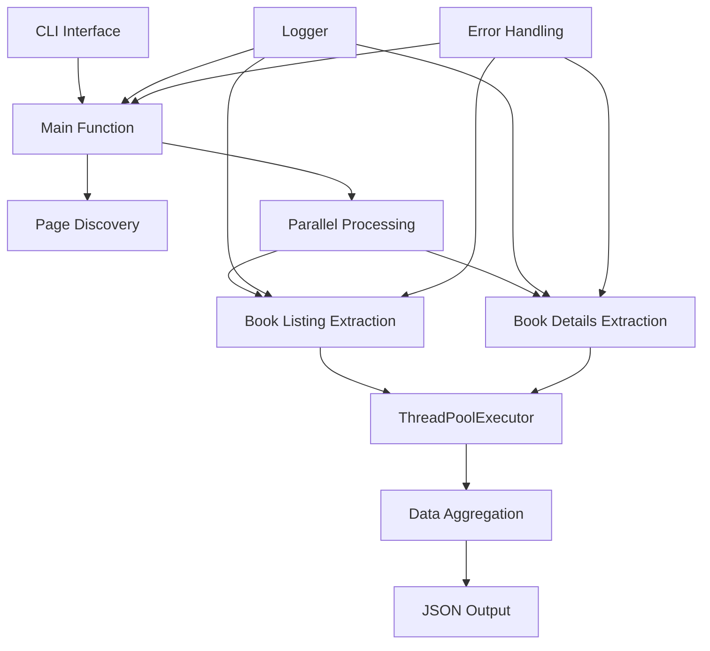

# Desenvolvimento

Guia completo para desenvolvedores que desejam contribuir com o projeto.

## Configuração do Ambiente de Desenvolvimento

### 1. Preparação Inicial

```bash
# Clone o repositório
git clone <repository-url>
cd <project-directory>

# Instale todas as dependências (incluindo desenvolvimento)
uv sync --all-groups
```

### 2. Ferramentas de Desenvolvimento

O projeto usa as seguintes ferramentas:

- **pytest** - Framework de testes
- **pytest-cov** - Relatórios de cobertura
- **ruff** - Linter e formatador
- **taskipy** - Executor de tarefas

### 3. Comandos de Desenvolvimento

```bash
# Executar testes com cobertura
uv run task test

# Verificar código com linter
uv run task lint

# Formatar código
uv run task format

# Ou usar pytest diretamente
uv run pytest --cov=. --cov-report=html
```

## Estrutura Detalhada do Projeto

### Visão Geral da Arquitetura

```
.
├── main.py                     # 🎯 Script principal com CLI e lógica de scraping
├── books.json                  # 📄 Arquivo de saída (gerado automaticamente)
├── pyproject.toml             # ⚙️ Configuração central do projeto
├── uv.lock                    # 🔒 Dependências bloqueadas (não editar)
├── .python-version            # 🐍 Versão do Python especificada
├── pytest.ini                # 🧪 Configuração de testes
├── .pre-commit-config.yaml    # 🔍 Hooks de qualidade de código
├── launch.json                # 🐛 Configuração de debug VS Code
├── utils/                     # 🛠️ Módulos utilitários
│   ├── __init__.py           # Inicialização do módulo
│   └── logger.py             # Configuração centralizada do Loguru
├── tests/                     # 🧪 Suíte completa de testes
│   ├── __init__.py
│   ├── conftest.py           # Configurações e fixtures globais
│   ├── fixtures/             # Dados de teste e mocks
│   └── test_main/            # Testes específicos do main.py
│       ├── test_cli.py       # Testes da interface CLI
│       ├── test_main_function.py  # Testes da função principal
│       ├── test_get_page_url.py   # Testes de geração de URLs
│       ├── test_get_total_pages.py # Testes de paginação
│       ├── test_process_book_details.py # Testes de detalhes
│       ├── test_integration.py     # Testes de integração
│       └── test_network_errors.py # Testes de erros de rede
├── logs/                      # 📝 Logs da aplicação (auto-criado)
│   ├── .gitkeep              # Manter diretório no Git
│   └── app.log               # Log principal (rotacionado)
├── docs/                      # 📚 Documentação MkDocs
│   ├── index.md              # Página inicial
│   ├── installation.md       # Guia de instalação
│   ├── usage.md              # Guia de uso
│   ├── development.md        # Este arquivo
│   ├── api-reference.md      # Referência da API
│   ├── troubleshooting.md    # Solução de problemas
│   └── assets/               # Imagens e recursos
├── htmlcov/                   # 📊 Relatórios de cobertura (gerado)
├── .mypy_cache/              # Cache do MyPy (gerado)
├── .pytest_cache/            # Cache do pytest (gerado)
├── .ruff_cache/              # Cache do Ruff (gerado)
├── __pycache__/              # Cache do Python (gerado)
└── .venv/                    # Ambiente virtual (gerado pelo UV)
```

### Componentes Principais

#### 1. **main.py** - Aplicação Principal
- **Função:** Script principal com toda a lógica de scraping
- **Responsabilidades:**
  - Interface CLI com argparse
  - Coordenação do processo de scraping
  - Processamento paralelo com ThreadPoolExecutor
  - Extração de dados das páginas
  - Salvamento em JSON
- **Padrões:** Single file application, funções com responsabilidade única

#### 2. **utils/** - Módulos Utilitários
- **logger.py:** Configuração centralizada do Loguru
  - Rotação automática de logs
  - Formatação colorida para console
  - Níveis de log configuráveis
  - Compressão de logs antigos

#### 3. **tests/** - Suíte de Testes
- **Estrutura modular:** Espelha a estrutura do código principal
- **Fixtures:** Dados de teste reutilizáveis em `fixtures/`
- **Categorias:** Unit, integration, error handling, CLI tests
- **Cobertura:** Meta de 100% de cobertura de código

#### 4. **Configurações**
- **pyproject.toml:** Configuração central (dependências, ferramentas, tasks)
- **pytest.ini:** Configuração de testes e cobertura
- **.pre-commit-config.yaml:** Hooks de qualidade de código
- **launch.json:** Configuração de debug para VS Code

## Padrões e Convenções de Código

### Convenções de Nomenclatura

#### Arquivos e Diretórios
```python
# ✅ Correto
main.py
utils/logger.py
tests/test_main/

# ❌ Incorreto
Main.py
utils/Logger.py
tests/TestMain/
```

#### Funções e Variáveis
```python
# ✅ Correto - snake_case
def process_book_details(book_data: Dict[str, Any]) -> Dict[str, Any]:
    max_workers = 10
    base_url = "https://books.toscrape.com/"

# ❌ Incorreto - camelCase ou PascalCase
def processBookDetails(bookData):
    maxWorkers = 10
    BaseUrl = "https://books.toscrape.com/"
```

#### Constantes
```python
# ✅ Correto - UPPER_CASE
DEFAULT_MAX_WORKERS = 10
BASE_URL = "https://books.toscrape.com/"
OUTPUT_FILENAME = "books.json"

# ❌ Incorreto
default_max_workers = 10
base_url = "https://books.toscrape.com/"
```

### Type Hints Obrigatórios

#### Funções Públicas
```python
from typing import Dict, List, Any, Optional

def process_book_listing(book: Adaptor, base_url: str) -> Dict[str, Any]:
    """Processa um livro da listagem e extrai dados básicos.

    Args:
        book (Adaptor): Elemento do livro.
        base_url (str): URL base do website.

    Returns:
        Dict[str, Any]: Dados extraídos do livro.
    """
    return extracted_data

def save_to_json(data: List[Dict[str, Any]], filename: str = "books.json") -> None:
    """Salva dados extraídos em arquivo JSON."""
    pass
```

#### Variáveis Complexas
```python
# ✅ Explícito para estruturas complexas
books_data: List[Dict[str, Any]] = []
rating_map: Dict[str, int] = {"one": 1, "two": 2, "three": 3}
futures: List[concurrent.futures.Future] = []

# ✅ Opcional para tipos simples óbvios
count = 0  # int óbvio
title = "Book Title"  # str óbvio
```

### Documentação Obrigatória

#### Docstrings Completas
```python
def extract_star_rating(book: Adaptor) -> int:
    """Extrai a avaliação em estrelas de um elemento livro.

    Procura pela classe CSS 'star-rating' e converte o texto
    da classe (One, Two, Three, etc.) para número inteiro.

    Args:
        book (Adaptor): Elemento do livro contendo a avaliação.

    Returns:
        int: Avaliação de 1-5 estrelas, ou 0 se não encontrada.

    Example:
        >>> book_element = page.find("li.book")
        >>> rating = extract_star_rating(book_element)
        >>> print(rating)  # 4

    Note:
        Retorna 0 se a avaliação não for encontrada ou for inválida.
    """
```

#### Comentários para Lógica Complexa
```python
def get_total_pages(page: Adaptor, base_url: str) -> int:
    # Procurar elemento de paginação
    pager = page.find("ul.pager")
    if not pager:
        return 1

    # Extrair informação da página atual usando regex
    # Formato esperado: "Page 1 of 50"
    current_page = pager.find("li.current")
    if current_page:
        page_text = current_page.text.strip()
        match = re.search(r"Page (\d+) of (\d+)", page_text)
        if match:
            return int(match.group(2))  # Retorna total de páginas

    return 1  # Fallback se não conseguir determinar
```

### Formatação e Estilo

#### Configuração Ruff
O projeto usa Ruff para formatação automática:

```bash
# Verificar estilo
uv run ruff check .

# Formatar automaticamente
uv run ruff format .

# Ou usar task
uv run task format
```

#### Regras de Formatação
- **Linha máxima:** 88 caracteres (padrão Black)
- **Indentação:** 4 espaços (nunca tabs)
- **Strings:** Aspas duplas preferenciais
- **Imports:** Organizados automaticamente pelo Ruff

#### Exemplo de Código Bem Formatado
```python
from scrapling.fetchers import Fetcher
from scrapling.parser import Adaptors, Adaptor
from utils.logger import logger
from tqdm import tqdm
import concurrent.futures
import re
from typing import Dict, List, Any
from urllib.parse import urljoin


def process_book_details(book_data: Dict[str, Any]) -> Dict[str, Any]:
    """Busca e processa página de detalhes do livro."""
    detail_url = book_data.get("detail_url")
    if not detail_url:
        logger.warning(f"No detail URL for book: {book_data.get('title')}")
        return book_data

    try:
        # Buscar página de detalhes
        logger.debug(f"Fetching details for: {book_data.get('title')}")
        detail_page = Fetcher.get(detail_url, stealthy_headers=True)

        if detail_page.status != 200:
            logger.warning(
                f"Failed to fetch detail page for {book_data.get('title')}. "
                f"Status: {detail_page.status}"
            )
            return book_data

        # Processar dados...
        return enhanced_book_data

    except Exception as e:
        logger.error(
            f"Error processing detail page for {book_data.get('title')}: {str(e)}"
        )
        return book_data
```

## Sistema de Testes Abrangente

### Executando Testes

#### Comandos Básicos
```bash
# Todos os testes com cobertura completa
uv run task test

# Ou diretamente com pytest
uv run pytest --cov=. --cov-report=html

# Testes específicos por módulo
uv run pytest tests/test_main/test_cli.py

# Testes com saída detalhada
uv run pytest -v --tb=long

# Testes rápidos (sem cobertura)
uv run pytest --no-cov
```

#### Comandos Avançados
```bash
# Executar apenas testes marcados
uv run pytest -m "unit"           # Apenas testes unitários
uv run pytest -m "integration"    # Apenas testes de integração
uv run pytest -m "not slow"       # Pular testes lentos

# Executar testes em paralelo (se instalado pytest-xdist)
uv run pytest -n auto

# Parar no primeiro erro
uv run pytest -x

# Executar apenas testes que falharam na última execução
uv run pytest --lf
```

### Estrutura de Testes

#### Organização por Categoria
```
tests/
├── conftest.py                    # Fixtures globais e configuração
├── fixtures/                     # Dados de teste
│   ├── mock_responses.py         # Respostas HTTP mockadas
│   └── test_data.py              # Dados de exemplo
└── test_main/                    # Testes do main.py
    ├── test_cli.py               # Interface de linha de comando
    ├── test_main_function.py     # Função principal
    ├── test_get_page_url.py      # Geração de URLs
    ├── test_get_total_pages.py   # Lógica de paginação
    ├── test_process_book_details.py  # Processamento de detalhes
    ├── test_integration.py       # Testes de integração
    └── test_network_errors.py    # Tratamento de erros de rede
```

#### Marcadores de Teste (pytest.ini)
```python
# Exemplo de uso de marcadores
import pytest

@pytest.mark.unit
def test_extract_star_rating():
    """Teste unitário para extração de avaliação."""
    pass

@pytest.mark.integration
def test_full_scraping_workflow():
    """Teste de integração do workflow completo."""
    pass

@pytest.mark.network
def test_network_timeout_handling():
    """Teste de tratamento de timeout de rede."""
    pass

@pytest.mark.slow
def test_large_dataset_processing():
    """Teste com dataset grande (execução lenta)."""
    pass
```

### Escrevendo Testes Eficazes

#### Estrutura de Teste (AAA Pattern)
```python
def test_process_book_listing():
    # Arrange - Preparar dados de teste
    mock_book = create_mock_book_element()
    base_url = "https://books.toscrape.com/"

    # Act - Executar função sendo testada
    result = process_book_listing(mock_book, base_url)

    # Assert - Verificar resultados
    assert result["title"] == "Expected Title"
    assert result["price"] == "£19.99"
    assert result["star_rating"] == 4
```

#### Fixtures Reutilizáveis
```python
# conftest.py
import pytest
from unittest.mock import Mock

@pytest.fixture
def mock_book_element():
    """Fixture para elemento de livro mockado."""
    book = Mock()
    book.find.return_value.attrib = {"title": "Test Book", "href": "test.html"}
    return book

@pytest.fixture
def sample_book_data():
    """Fixture para dados de livro de exemplo."""
    return {
        "title": "Test Book",
        "price": "£19.99",
        "star_rating": 4,
        "detail_url": "https://example.com/book/1"
    }

# Uso em testes
def test_book_processing(mock_book_element, sample_book_data):
    result = process_book_listing(mock_book_element, "https://example.com")
    assert result["title"] == sample_book_data["title"]
```

#### Testes de Erro e Edge Cases
```python
def test_extract_star_rating_no_rating():
    """Testa comportamento quando não há avaliação."""
    mock_book = Mock()
    mock_book.find.return_value = None

    result = extract_star_rating(mock_book)

    assert result == 0

def test_process_book_details_network_error():
    """Testa tratamento de erro de rede."""
    book_data = {"detail_url": "https://invalid-url.com"}

    with patch('main.Fetcher.get') as mock_get:
        mock_get.side_effect = ConnectionError("Network error")

        result = process_book_details(book_data)

        # Deve retornar dados originais em caso de erro
        assert result == book_data
```

#### Mocking de Dependências Externas
```python
from unittest.mock import patch, Mock

@patch('main.Fetcher.get')
def test_successful_page_fetch(mock_get):
    """Testa busca bem-sucedida de página."""
    # Configurar mock
    mock_response = Mock()
    mock_response.status = 200
    mock_response.find_all.return_value = [Mock(), Mock()]
    mock_get.return_value = mock_response

    # Executar função
    result = main(max_workers=5, max_pages=1)

    # Verificar chamadas
    mock_get.assert_called_once()
    assert mock_response.find_all.called
```

### Cobertura de Código

#### Meta de Cobertura
- **Objetivo:** 100% de cobertura (configurado em pytest.ini)
- **Mínimo aceitável:** 95% para PRs
- **Relatórios:** HTML gerado em `htmlcov/`

#### Verificar Cobertura
```bash
# Executar testes com relatório de cobertura
uv run task test

# Abrir relatório HTML
open htmlcov/index.html  # macOS
xdg-open htmlcov/index.html  # Linux
start htmlcov/index.html  # Windows

# Ver cobertura no terminal
uv run pytest --cov=. --cov-report=term-missing
```

#### Excluir Código da Cobertura
```python
def debug_function():  # pragma: no cover
    """Função apenas para debug, não testada."""
    print("Debug info")

if __name__ == "__main__":  # pragma: no cover
    # Bloco de execução principal
    main()
```

## Debug e Troubleshooting

### Configuração do VS Code

#### Launch Configuration
O arquivo `launch.json` contém configurações pré-definidas:

```json
{
    "version": "0.2.0",
    "configurations": [
        {
            "name": "Python: main.py com argumentos",
            "type": "python",
            "request": "launch",
            "program": "${workspaceFolder}/main.py",
            "args": ["--threads", "5", "--pages", "2"],
            "console": "integratedTerminal",
            "cwd": "${workspaceFolder}",
            "env": {
                "PYTHONPATH": "${workspaceFolder}"
            }
        }
    ]
}
```

#### Personalizando Debug
```json
// Para debug de uma página específica
"args": ["--threads", "1", "--pages", "1"]

// Para debug de alta concorrência
"args": ["--threads", "20", "--pages", "5"]

// Para debug sem argumentos (padrões)
"args": []
```

#### Breakpoints Estratégicos
```python
def process_book_details(book_data: Dict[str, Any]) -> Dict[str, Any]:
    detail_url = book_data.get("detail_url")

    # 🔴 Breakpoint aqui para verificar URLs
    if not detail_url:
        logger.warning(f"No detail URL for book: {book_data.get('title')}")
        return book_data

    try:
        # 🔴 Breakpoint aqui para verificar requisições
        detail_page = Fetcher.get(detail_url, stealthy_headers=True)

        # 🔴 Breakpoint aqui para verificar respostas
        if detail_page.status != 200:
            return book_data

    except Exception as e:
        # 🔴 Breakpoint aqui para capturar exceções
        logger.error(f"Error: {str(e)}")
        return book_data
```

### Sistema de Logging Avançado

#### Configuração Atual (utils/logger.py)
```python
from loguru import logger

# Configuração automática com:
# - Rotação por tamanho (10 MB)
# - Compressão de logs antigos
# - Formatação colorida no console
# - Níveis configuráveis
```

#### Uso Eficaz do Logging
```python
from utils.logger import logger

# ✅ Níveis apropriados
logger.debug("Detalhes técnicos para desenvolvimento")
logger.info("Informações importantes do fluxo")
logger.success("Operação concluída com sucesso")
logger.warning("Situação que merece atenção")
logger.error("Erro que não impede continuação")
logger.critical("Erro crítico que para execução")

# ✅ Contexto útil
logger.info(f"Processing page {page_num}/{total_pages}: {page_url}")
logger.error(f"Failed to fetch {url}. Status: {status}. Retrying...")

# ✅ Dados estruturados
logger.info("Scraping completed", extra={
    "total_books": len(all_books),
    "pages_processed": total_pages,
    "duration_seconds": elapsed_time
})
```

#### Debug com Logs Temporários
```python
def debug_book_processing(book_data):
    # Logs temporários para debug (remover depois)
    logger.debug(f"DEBUG: Book data keys: {list(book_data.keys())}")
    logger.debug(f"DEBUG: Detail URL: {book_data.get('detail_url')}")

    result = process_book_details(book_data)

    logger.debug(f"DEBUG: Result keys: {list(result.keys())}")
    return result
```

### Debugging de Problemas Comuns

#### 1. Problemas de Rede
```python
# Adicionar logs detalhados para requisições
def fetch_with_debug(url):
    logger.debug(f"Fetching URL: {url}")
    try:
        response = Fetcher.get(url, stealthy_headers=True)
        logger.debug(f"Response status: {response.status}")
        logger.debug(f"Response headers: {dict(response.headers)}")
        return response
    except Exception as e:
        logger.error(f"Network error for {url}: {type(e).__name__}: {e}")
        raise
```

#### 2. Problemas de Parsing
```python
def debug_element_extraction(element, selector):
    found = element.find(selector)
    if not found:
        logger.warning(f"Selector '{selector}' not found in element")
        logger.debug(f"Available elements: {[tag.name for tag in element.find_all()]}")
    return found
```

#### 3. Problemas de Concorrência
```python
import threading

def thread_safe_logging(message):
    thread_id = threading.current_thread().ident
    logger.debug(f"[Thread {thread_id}] {message}")

# Usar em funções executadas em threads
def process_book_with_debug(book_data):
    thread_safe_logging(f"Processing book: {book_data.get('title')}")
    result = process_book_details(book_data)
    thread_safe_logging(f"Completed book: {book_data.get('title')}")
    return result
```

### Ferramentas de Debug Externas

#### Python Debugger (pdb)
```python
import pdb

def problematic_function(data):
    # Inserir breakpoint programático
    pdb.set_trace()

    # Código a ser debugado
    result = complex_processing(data)
    return result

# Comandos úteis no pdb:
# n (next) - próxima linha
# s (step) - entrar em função
# c (continue) - continuar execução
# l (list) - mostrar código atual
# p variable - imprimir variável
# pp variable - pretty print variável
```

#### Profiling de Performance
```python
import cProfile
import pstats

def profile_main():
    """Executar main() com profiling."""
    cProfile.run('main(max_workers=10, max_pages=5)', 'profile_stats')

    # Analisar resultados
    stats = pstats.Stats('profile_stats')
    stats.sort_stats('cumulative')
    stats.print_stats(20)  # Top 20 funções mais lentas

# Executar profiling
if __name__ == "__main__":
    profile_main()
```

#### Memory Profiling
```python
from memory_profiler import profile

@profile
def memory_intensive_function():
    """Função com profiling de memória."""
    large_data = []
    for i in range(10000):
        large_data.append(process_book_data(sample_data))
    return large_data

# Executar com: uv run python -m memory_profiler script.py
```

## Processo de Contribuição

### Workflow de Desenvolvimento

#### 1. Preparação Inicial
```bash
# Fork o repositório no GitHub
# Clone seu fork
git clone https://github.com/SEU_USUARIO/web-scraping-project.git
cd web-scraping-project

# Adicionar upstream para sincronização
git remote add upstream https://github.com/ORIGINAL_OWNER/web-scraping-project.git

# Instalar dependências de desenvolvimento
uv sync --all-groups

# Instalar pre-commit hooks
uv run pre-commit install
```

#### 2. Criação de Feature Branch
```bash
# Sincronizar com upstream
git fetch upstream
git checkout main
git merge upstream/main

# Criar branch para nova feature
git checkout -b feature/nome-da-funcionalidade

# Ou para bugfix
git checkout -b fix/descricao-do-bug

# Ou para documentação
git checkout -b docs/melhoria-documentacao
```

#### 3. Desenvolvimento
```bash
# Fazer mudanças no código
# Executar testes frequentemente
uv run task test

# Verificar formatação
uv run task format

# Verificar linting
uv run task lint

# Commit das mudanças
git add .
git commit -m "feat: adiciona nova funcionalidade X"
```

#### 4. Preparação para PR
```bash
# Sincronizar com upstream novamente
git fetch upstream
git rebase upstream/main

# Push da branch
git push origin feature/nome-da-funcionalidade

# Abrir Pull Request no GitHub
```

### Padrões de Commit

#### Conventional Commits
```bash
# Tipos de commit
feat: nova funcionalidade
fix: correção de bug
docs: mudanças na documentação
style: formatação, sem mudança de lógica
refactor: refatoração sem mudança de comportamento
test: adição ou correção de testes
chore: mudanças em ferramentas, configurações

# Exemplos
git commit -m "feat: adiciona suporte para múltiplos formatos de saída"
git commit -m "fix: corrige extração de avaliação quando elemento não existe"
git commit -m "docs: atualiza guia de instalação com troubleshooting"
git commit -m "test: adiciona testes para função extract_star_rating"
```

#### Mensagens Descritivas
```bash
# ✅ Bom - específico e claro
git commit -m "fix: handle missing star rating elements gracefully"

# ❌ Ruim - vago
git commit -m "fix bug"

# ✅ Bom - explica o porquê
git commit -m "refactor: extract URL building to separate function for reusability"

# ❌ Ruim - não explica impacto
git commit -m "change function"
```

### Diretrizes de Qualidade

#### Código
- **Cobertura de testes:** Manter 100% (mínimo 95%)
- **Type hints:** Obrigatório para funções públicas
- **Docstrings:** Obrigatório para funções públicas
- **Formatação:** Usar Ruff (automático com pre-commit)
- **Linting:** Zero erros do Ruff

#### Testes
- **Novos recursos:** Devem ter testes unitários e de integração
- **Bug fixes:** Devem incluir teste que reproduz o bug
- **Edge cases:** Testar casos extremos e de erro
- **Mocks:** Usar para dependências externas (rede, arquivos)

#### Documentação
- **README:** Atualizar se mudanças afetam uso
- **Docstrings:** Atualizar se assinatura de função muda
- **Changelog:** Adicionar entrada para mudanças significativas
- **Exemplos:** Atualizar se API muda

### Checklist Completo para PR

#### ✅ Antes de Abrir PR
```bash
# Executar todos os checks
uv run task test     # Testes passando
uv run task lint     # Linting limpo
uv run task format   # Código formatado

# Verificar cobertura
open htmlcov/index.html

# Testar instalação limpa
rm -rf .venv
uv sync --all-groups
uv run main.py --help

# Verificar documentação
uv run task docs
```

#### ✅ Conteúdo do PR
- [ ] **Título claro:** Descreve mudança em uma linha
- [ ] **Descrição detalhada:** Explica o que, por que, como
- [ ] **Testes incluídos:** Para novas funcionalidades e fixes
- [ ] **Documentação atualizada:** Se aplicável
- [ ] **Breaking changes:** Claramente marcadas
- [ ] **Screenshots:** Se mudanças visuais

#### ✅ Template de PR
```markdown
## Descrição
Breve descrição das mudanças realizadas.

## Tipo de Mudança
- [ ] Bug fix (mudança que corrige um problema)
- [ ] Nova funcionalidade (mudança que adiciona funcionalidade)
- [ ] Breaking change (mudança que quebra compatibilidade)
- [ ] Documentação (mudança apenas na documentação)

## Como Testar
1. Execute `uv sync --all-groups`
2. Execute `uv run main.py --threads 5 --pages 2`
3. Verifique que...

## Checklist
- [ ] Testes passando (`uv run task test`)
- [ ] Código formatado (`uv run task format`)
- [ ] Linting limpo (`uv run task lint`)
- [ ] Documentação atualizada
- [ ] Cobertura de testes mantida
```

### Code Review

#### Para Reviewers
- **Funcionalidade:** A mudança resolve o problema?
- **Testes:** Cobertura adequada e casos relevantes?
- **Performance:** Impacto na performance?
- **Segurança:** Introduz vulnerabilidades?
- **Manutenibilidade:** Código fácil de entender e manter?

#### Para Contributors
- **Responda feedback:** De forma construtiva e rápida
- **Faça mudanças:** Em commits separados para facilitar review
- **Teste sugestões:** Antes de aplicar
- **Seja paciente:** Review leva tempo e é importante

## Arquitetura Detalhada

### Visão Geral do Sistema



### Componentes Principais

#### 1. **CLI Interface (main.py)**
```python
# Responsabilidades:
# - Parsing de argumentos de linha de comando
# - Validação de parâmetros de entrada
# - Chamada da função principal

if __name__ == "__main__":
    parser = argparse.ArgumentParser(description="Web scraper with multithreading")
    parser.add_argument("--threads", type=int, default=10)
    parser.add_argument("--pages", type=int, default=1)
    args = parser.parse_args()
    main(max_workers=args.threads, max_pages=args.pages)
```

#### 2. **Coordenador Principal (main function)**
```python
def main(max_workers: int = 10, max_pages: int = 1) -> None:
    """
    Orquestra todo o processo de scraping:
    1. Descoberta de páginas disponíveis
    2. Processamento paralelo de cada página
    3. Agregação e salvamento de dados
    """
```

#### 3. **Processamento Paralelo**
```python
# Duas camadas de paralelização:
# 1. Extração de listagens (rápida)
with ThreadPoolExecutor(max_workers=max_workers) as executor:
    listing_futures = [executor.submit(process_book_listing, book, base_url)
                      for book in books]

# 2. Busca de detalhes (lenta, I/O bound)
with ThreadPoolExecutor(max_workers=max_workers) as executor:
    detail_futures = [executor.submit(process_book_details, book_data)
                     for book_data in page_books]
```

#### 4. **Extração de Dados**
- **Listagem:** Dados básicos da página de catálogo
- **Detalhes:** Informações completas da página individual
- **Robustez:** Fallbacks para dados ausentes

#### 5. **Sistema de Logging**
```python
# Configuração centralizada em utils/logger.py
# - Logs estruturados com contexto
# - Rotação automática
# - Níveis apropriados para debug/produção
```

### Padrões Arquiteturais

#### Single Responsibility Principle
```python
# ✅ Cada função tem uma responsabilidade clara
def extract_star_rating(book: Adaptor) -> int:
    """Apenas extrai avaliação em estrelas."""

def process_book_listing(book: Adaptor, base_url: str) -> Dict[str, Any]:
    """Apenas processa dados da listagem."""

def process_book_details(book_data: Dict[str, Any]) -> Dict[str, Any]:
    """Apenas busca e processa detalhes."""
```

#### Error Handling Strategy
```python
# Estratégia de degradação graceful
def process_book_details(book_data: Dict[str, Any]) -> Dict[str, Any]:
    try:
        # Tentar buscar detalhes
        enhanced_data = fetch_and_process_details(book_data)
        return enhanced_data
    except Exception as e:
        # Log do erro mas continua com dados básicos
        logger.error(f"Error processing details: {e}")
        return book_data  # Fallback para dados básicos
```

#### Separation of Concerns
```python
# Separação clara entre:
# 1. Lógica de negócio (extração de dados)
# 2. I/O operations (requisições HTTP)
# 3. Data persistence (salvamento JSON)
# 4. User interface (CLI)
# 5. Logging e monitoring
```

### Performance e Escalabilidade

#### Otimizações Implementadas
- **Paralelização:** ThreadPoolExecutor para I/O concorrente
- **Reutilização:** Primeira página já carregada é reutilizada
- **Progress tracking:** tqdm para feedback visual
- **Memory efficiency:** Processamento por página, não tudo em memória

#### Limitações Atuais
- **Single-threaded JSON write:** Bottleneck no final
- **No caching:** Cada execução refaz todo trabalho
- **No rate limiting:** Pode sobrecarregar servidor
- **Memory growth:** Lista cresce com número de livros

#### Melhorias Futuras Possíveis
```python
# Possíveis extensões:
# 1. Cache de resultados
# 2. Rate limiting configurável
# 3. Múltiplos formatos de saída
# 4. Resumo de execuções interrompidas
# 5. Configuração via arquivo
```

## Recursos Adicionais

### Documentação Técnica
- **[API Reference](api-reference.md):** Documentação detalhada de funções
- **[Troubleshooting](troubleshooting.md):** Soluções para problemas comuns
- **[Usage Guide](usage.md):** Exemplos práticos de uso

### Ferramentas de Desenvolvimento
```bash
# Análise de código
uv run mypy .                    # Type checking
uv run ruff check .              # Linting
uv run pytest --cov=.           # Testes e cobertura

# Documentação
uv run task docs                 # Servir documentação localmente
uv run task docs-build           # Build documentação para deploy

# Profiling e análise
uv run python -m cProfile main.py --threads 10 --pages 5
uv run python -m memory_profiler main.py
```

### Comunidade e Contribuição
- **Issues:** Reporte bugs e sugira melhorias
- **Discussions:** Participe de discussões técnicas
- **Pull Requests:** Contribua com código seguindo as diretrizes
- **Documentation:** Ajude a melhorar a documentação
